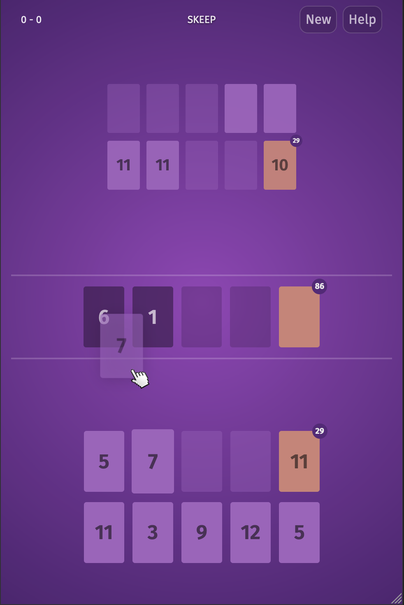

# SKEEP

SKEEP is a clone of a popular card game.  You play against the computer.



[Play Online Now](https://skeep.glitch.me)

## Board

You have a *stock pile* of cards, 4 *discard piles* of cards, and a *hand* of 5
cards.  As does the computer (top portion).  There are 4 shared *build piles*
and a single *draw pile*.

## Objective

The objective is to be the first player to play all the cards in your stock pile.

## Gameplay

Players take turns trying to build sequences of cards from 1-12 in the 4
build piles by moving cards from your stock pile, one of the discard piles, or
your hand.

### Discarding

When no moves are possible in your turn, discard a card from your hand to one of
4 discard piles. If you play all 5 cards in your hand, you will be drawn
another 5 immediately.  Discard piles do not require a sequence like the build
piles require.

### Wilds

`W` cards are *wild*.  A wild card can take any value.  Placing a `W` atop a 8
on one of the build piles effectively makes the `W` take the value 9.

## Controls

### Moving a card

To move a card, select the card and then select the target card pile.
To deselect a selected card, select the card again.
On desktop browsers, you can also drag and drop the cards.

### Toggle Help

Help is available in game.  Select the "Help" button in the top-left to toggle.

### Starting a new game

Reload the page or select the "New" button in the top-right.

## Caveats

A new game is started on load.  You cannot continue old games if you close your
browser window/tab.

The CPU opponent employs very little strategy and is thus fairly easy to beat
most of time.

## Local Development

```
npx http-server -H ./no-cache-headers.json
```

Visit http://localhost:8080

## Author

Brian Hammond <brian@fictorial.com>

## Copyright

Copyright (C) 2019-2022 Fictorial LLC.  All Rights Reserved.

## License

No license is granted as this is a clone of an already popular card game.
You may not distribute this code in any form.  Just enjoy it here, OK?
